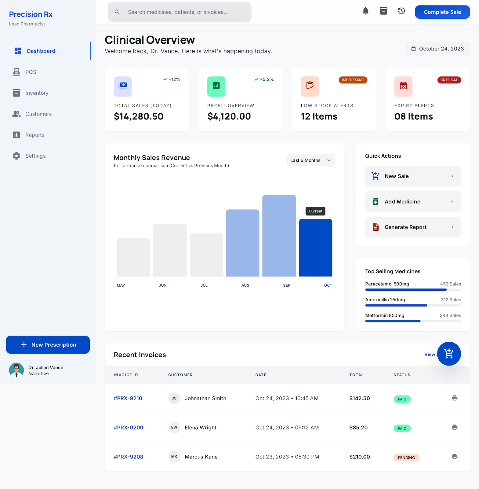
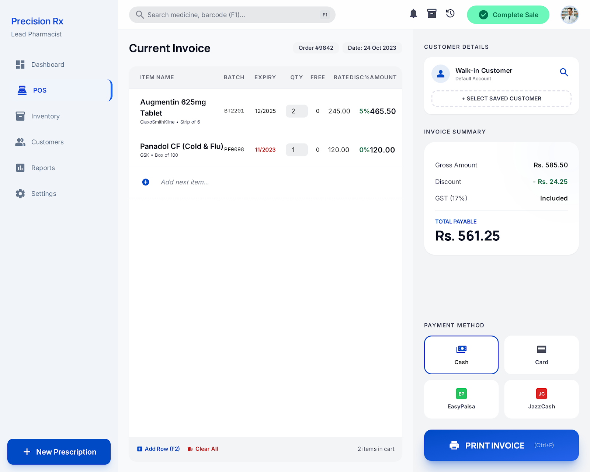
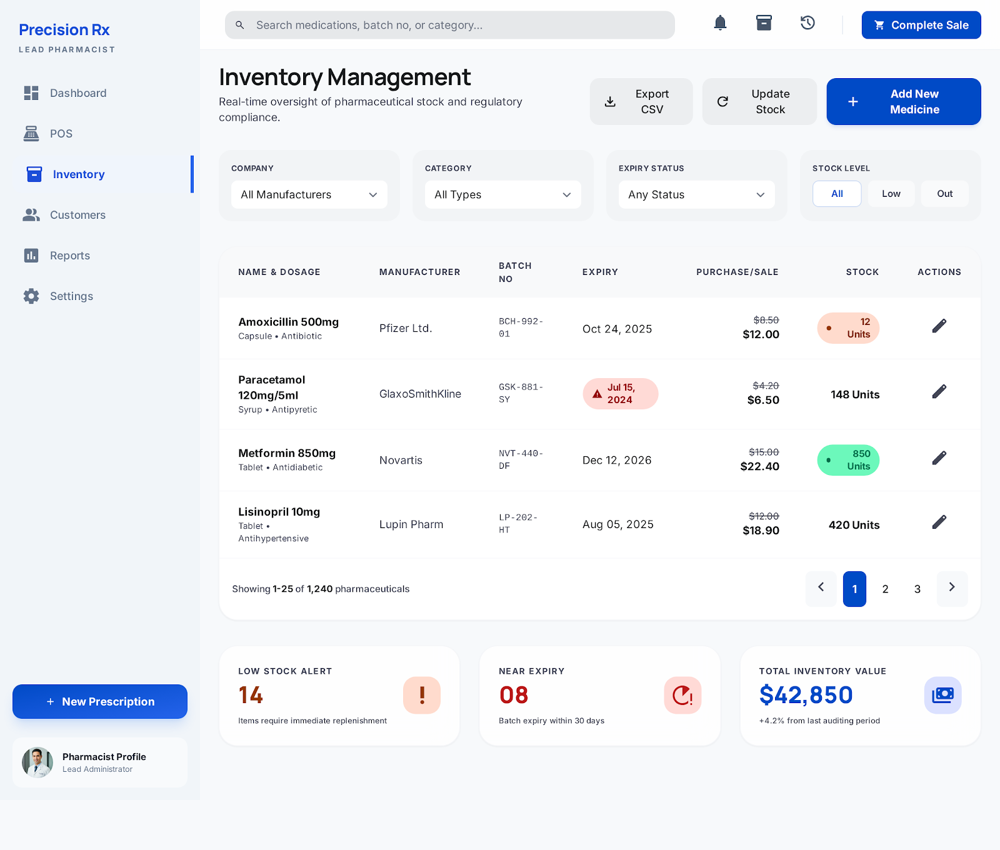
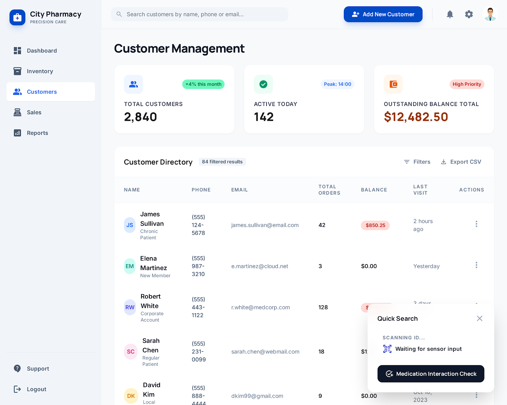
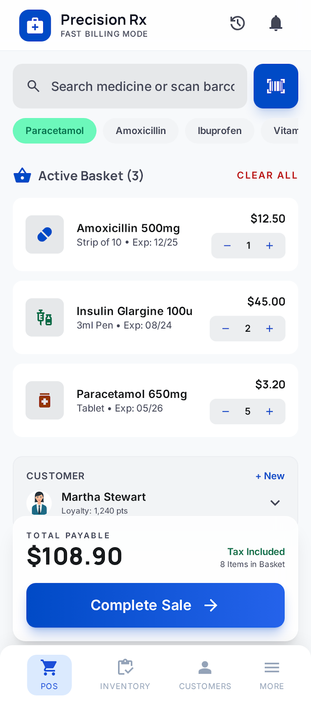

# 💊 Precision Rx | Premium Pharmacy Management System

[](https://tailwindcss.com)
[](https://developer.mozilla.org/en-US/docs/Web/JavaScript)
[](https://developer.mozilla.org/en-US/docs/Web/HTML)

**Precision Rx** is a state-of-the-art, responsive Medical Point of Sale (POS) and Inventory Management System designed for modern pharmacies and clinical environments. It combines high-performance utility with a premium, aesthetic user interface.



---

## ✨ Key Features

### 📊 Clinical Dashboard
* **Real-time Analytics:** Track daily sales, profit margins, and revenue growth.
* **Smart Alerts:** Instant notifications for low stock and expiring items.
* **Performance Charts:** Visualize monthly sales revenue with dynamic bar charts.

### 💳 Advanced Billing Terminal (POS)
* **Retail-Ready Interface:** Optimized for fast checkout with keyboard shortcut support.
* **Patient Management:** Quickly find or add new patients directly from the billing screen.
* **Barcode Integration:** Ready for barcode scanners to expedite item entry.
* **Thermal Receipts:** Professional thermal receipt generation with print-preview functionality.

### 📦 Inventory & Medicine Management
* **Batch Tracking:** Manage medications by batch numbers and expiry dates.
* **Detailed Categorization:** Organize items by manufacturer, type (antibiotics, paracetamols, etc.), and unit.
* **Dynamic Search:** Find any medication in seconds using the global search bar.

### 👥 Customer Profiles
* **Patient History:** Detailed logs of past purchases and medical records.
* **Profile Management:** Easily update contact info and medical profiles.

---

## 🛠️ Tech Stack

* **Structure:** [HTML5 Semantic Elements](https://developer.mozilla.org/en-US/docs/Web/HTML)
* **Styling:** [Tailwind CSS](https://tailwindcss.com) (utility-first framework)
* **Interactions:** Vanilla JavaScript (ES6+)
* **Typography:** [Manrope](https://fonts.google.com/specimen/Manrope) (Headlines) & [Inter](https://fonts.google.com/specimen/Inter) (Body)
* **Icons:** [Material Symbols Outlined](https://fonts.google.com/icons)

---

## 📸 Interface Gallery

````carousel

<!-- slide -->

<!-- slide -->

<!-- slide -->

````

---

## 🚀 Getting Started

Since **Precision Rx** is built as a highly optimized static web application, getting started is simple:

1. **Clone the repository:**
   ```bash
   git clone https://github.com/your-username/medical-pos.git
   ```
2. **Open the project:**
   Simply open `dashboard_overview.html` in any modern web browser (Chrome, Edge, Firefox, or Safari).

> [!TIP]
> For the best experience, use a local server like Live Server (VS Code Extension) or run `python -m http.server 8000` in the project directory.

---

## 📱 Responsiveness
Precision Rx is fully responsive. It features a collapsible sidebar for desktops and a bottom navigation bar for mobile devices, ensuring pharmacists can manage sales on the go.

---

## 📄 License
This project is licensed under the MIT License - see the [LICENSE](LICENSE) file for details.

---

<p align="center">
  Developed with ❤️ for the Medical Community
</p>
